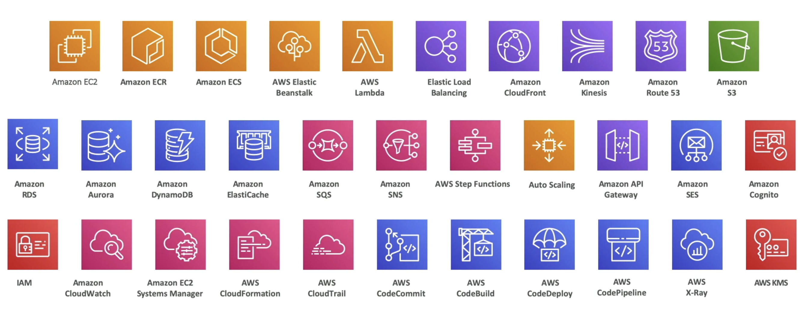
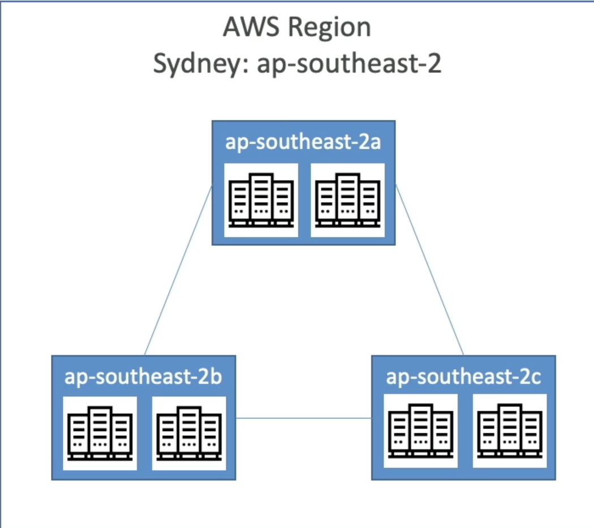
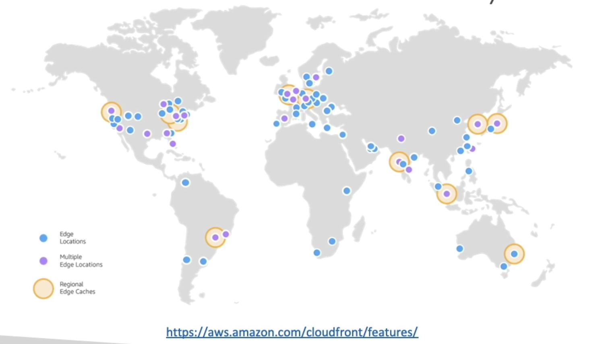

# Basics of AWS

## Lists of topics to cover to master the developer associate certification

## History Of AWS Cloud

- **2002**: Launched internally at amazon.com
- **2003**: Amazon infrastructure was their core strength and they decided to publicize it to the IT market
- **2004**: Launched publicly with Amazon SQS
- **2006**: Relaunched with the ability of SQS, S3 and EC2
- **2007**: Launched across the world starting with Europe

## AWS Cloud Use Cases

- AWS enables you to build sophisticated, usable applications
- Applicable to a diverse set of industries
- Use cases include
  - Enterprise IT, Backup and Storage, Big Data Analytics
  - Website hosting, Mobile and Social Apps
  - Gaming

## AWS Global Infrastructure

- Regions
  - Locations where AWS Servers are present.
  - A region is a cluster of data centers
  - Most AWS services are region-scoped. That is, if you use a service in one region and try using that service in another region, that service will be timed differently
  - Have names such as us-east-1, ap-south-1 etc
  - Eg: Mumbai, N. California, N. Virginia etc
- Availability Zones
  - Each region has multiple availability zones, usually 3. Minimum is 3, maximum is 6
  - Each availability zone consists of 1 or more discrete data centers with redundant power, networking and connectivity.
  - The availability zones are seperated from each other so that they are isolated from each other
  - They are connected with high bandwidth, ultra-low latency networking
    
- Data Centers
- Edge Locations/Points of Presence
  
- [See how AWS is global](https://aws.amazon.com/about-aws/global-infrastructure/regions_az/)

### How to choose an AWS Region?

- It depends on various factors

1. **Compliance**: Should be compliant with data governance and legal requirements. Sometimes governments want the data to be local to the region you are staying in.
2. **Proximity to customers**: Go for a region where customers experience the lowest latency/lag
3. **Available Services within a region**: New services and new features aren't available in every region. Go for the region that has the services you want
4. **Pricing**: Pricing varies from region to region. You need to consult the services pricing page.

## Tour of the AWS Console

### Global Services

- Identity and Access Management
- Route 53 (DNS Service)
- CloudFront (Content Delivery Network)
- WAF (Web Application Firewall)

### Region-Scoped Services

- Amazon EC2 (Infrastructure as a Service)
- Elastic BeanStalk (Platform as a Service)
- Lambda (Function as a Service)
- Rekognition (Software as a Service)

- Check if there is a service available in your region by looking into the [region table](https://aws.amazon.com/about-aws/global-infrastructure/regional-product-services/)
