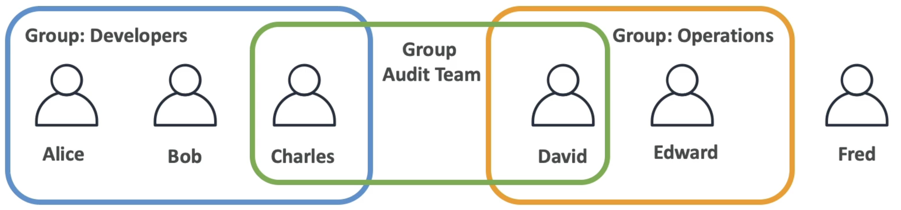
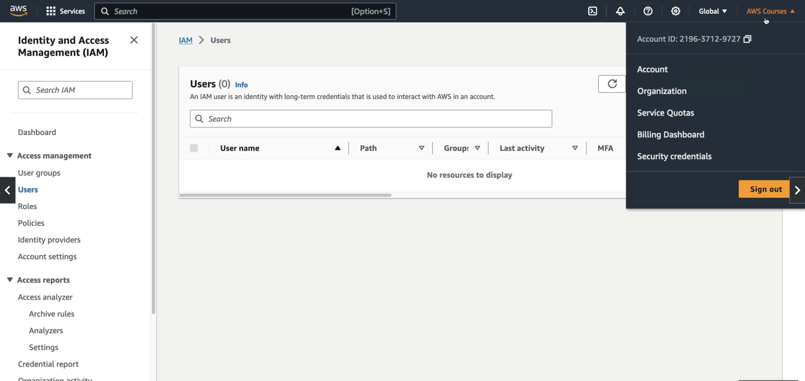
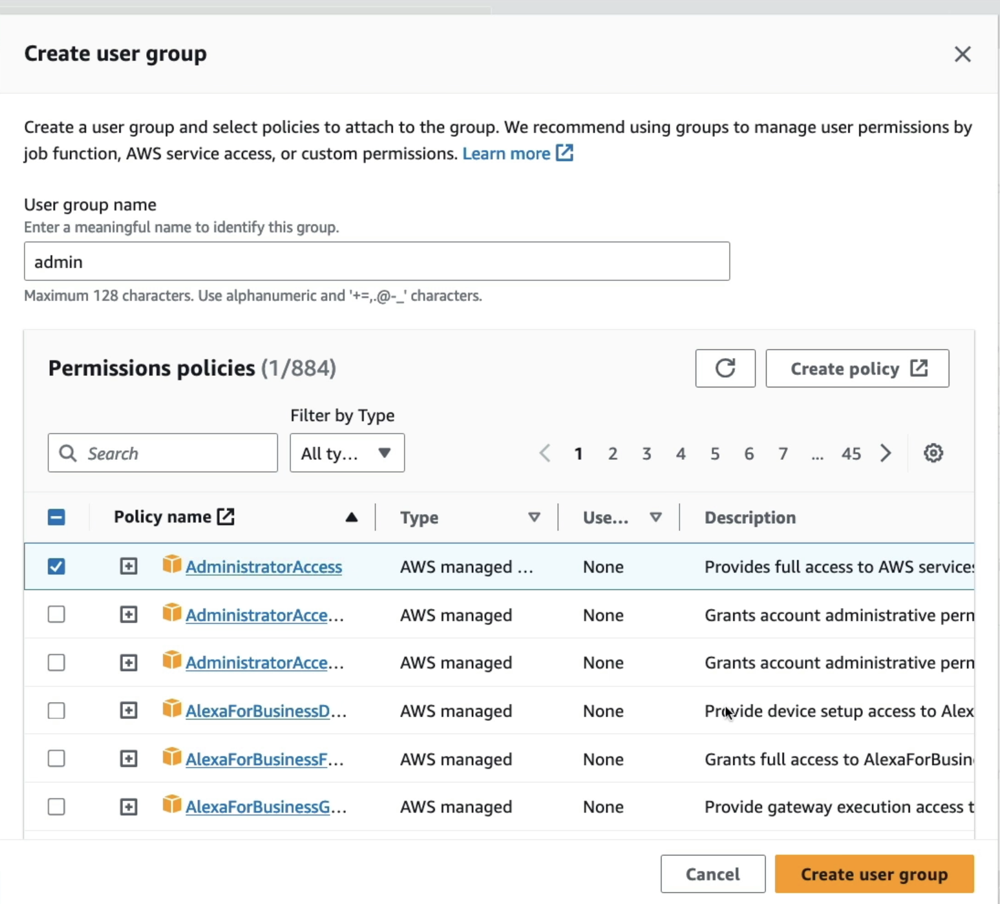
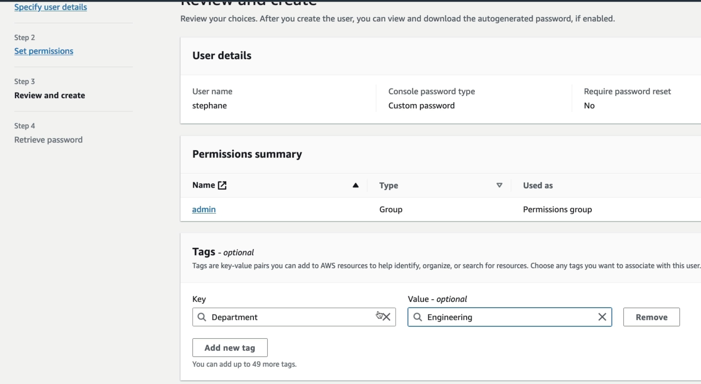
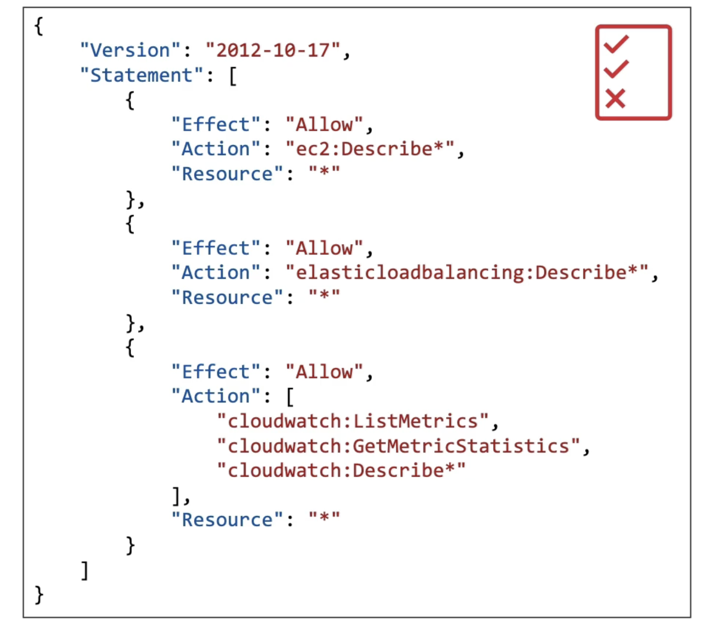

# IAM and AWS CLI

## IAM Users and Groups

- **IAM** - Identity Access and Management
- Global Service
- In IAM, we create users and assign them to group.
- When we created an account, we created root, our default user for the account. This was done via IAM.
- Users are people in your organization and they can be grouped
- Groups can only contain users, not other groups
- Users don't have to belong to a group but that is not good practice. Also users can belong to other, multiple groups
  

### Hands-On

- You can know that you are the root user by clicking on your username on the top right and observing that you can see your account ID
  
- Create a user and give it a username. Give it access to the IAM console if it's an admin user.
- Create an IAM user and set the password. Usually set it to autogenerated password and select the option where it says the user must create a new password at the next sign-in.
- Next, you need to permissions. You can either add permissions directly (not recommended) or you can create a group.
- If you are going to be creating an admin group, give it Administrator Access
  
- You can also give tags to resources to help identify resources.
  

## IAM Permissions

- Users or groups can be assigned JSON documents called policies
- These policies define the permissions of the users. You don't want to give the users too much power otherwise they could breach the security
- In AWS you apply the least privilege principle, that is, you don't give the user more than he needs
  

### IAM Policies Structure

- Consists of

  - **Version**: Policy language version, always include "2012-10-17"
  - **Id**: An identifier for the policy (optional)
  - **Statement**: One or more individual statements (required)

- Statement consists of
  - **Sid**: an identifier for the statement (optional)
  - **Effect**: Whether the statement allows or denies access (Allow, Deny)
  - **Principal**: Account/user/role to which the policy is applied to
  - **Action**: List of actions this policy allows or denies
  - **Resource**: List of resources to which the actions applied to
  - **Condition** (not represented in the screenshot): conditions for when the policy is in effect (optional)
